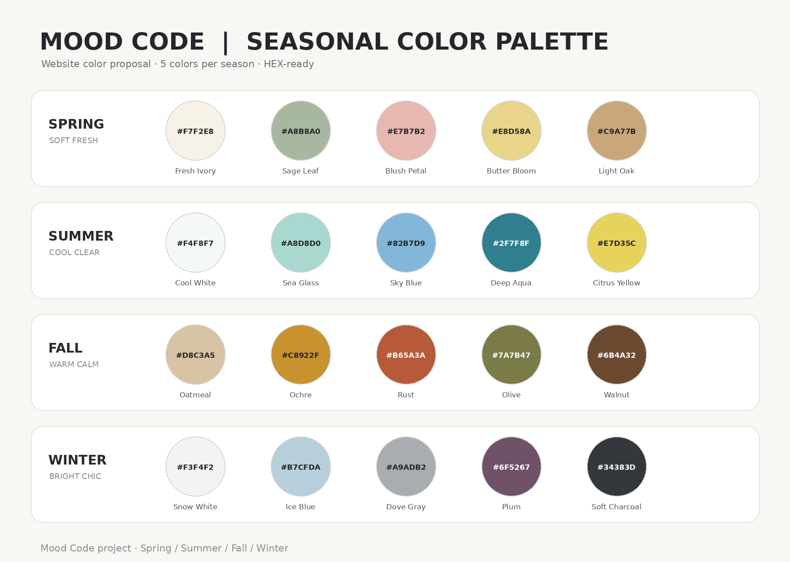

# 🎨 MOOD CODE | Flask Team Project

공간 디자인 제안 및 계절별 컬러 팔레트를 제공하는 인테리어 추천 웹 서비스입니다.

---

## 📁 데이터 및 이미지 폴더 구조 (`MOODCODE_COMPLETE_...`)

프로젝트에서 사용되는 **원본 공간 이미지, 상품 위치 표기 이미지, CSV 데이터, 계절별 컬러 팔레트**의 전체 구조입니다.

```text
MOODCODE_COMPLETE_ORIGINALS_POSITION_TAGGED_CSV_132_FINAL/
├── originals/                      # 고해상도 원본 이미지 (64개, 1536×1024)
│   ├── living/ (spring~winter)
│   ├── dining/ (spring~winter)
│   ├── bedroom/ (spring~winter)
│   └── balcony/ (spring~winter)
│
├── tagged/                         # 상품 위치 번호 표기 이미지 (64개, 768×512)
│   ├── living/ (spring~winter)
│   ├── dining/ (spring~winter)
│   ├── bedroom/ (spring~winter)
│   └── balcony/ (spring~winter)
│
├── csv/                            # 공간별 메인 상품 DB 데이터 (4개)
│   ├── moodcode_living_4seasons_16_final.csv
│   ├── moodcode_dining_4seasons_16_final.csv
│   ├── moodcode_bedroom_4seasons_16_final.csv
│   └── moodcode_balcony_4seasons_16_final.csv
│
└── moodcode_season_color_palette_package/  # 계절별 UI 컬러 팔레트
    ├── moodcode_season_circle_palette.png   # 원형 팔레트 가이드 이미지
    ├── moodcode_season_color_palette.csv    # 개발용 CSS/HEX 컬러 데이터
    └── moodcode_season_color_palette.xlsx   # 디자인/기획 검토용 엑셀

📌 상품 위치 번호 표기 규칙 (tagged 이미지)코드 표기 이미지(tagged) 내에 표기된 숫자(1~4)는 실제 상품의 위치와 1:1로 대응됩니다.1: 중심 상품 (거실: 소파 / 주방: 식탁 / 침실: 침대 / 발코니: 메인 가구)2: 보조 테이블3: 조명4: 디퓨저/향기 제품하단 정보 표기 예시:1 SOFA (MC-SF-005) | 2 TABLE (MC-LT-013) | 3 LIGHT (MC-LT-007) | 4 SCENT (MC-DF-002)🎨 계절별 UI 테마 컬러 팔레트 (moodcode_season_color_palette)웹사이트 테마 적용 시 moodcode_season_color_palette.csv의 CSS 변수(--season-{계절}-{번호})를 활용하세요.계절대표 무드HEX 컬러 코드봄 (Spring)Soft Fresh#F7F2E8 (아이보리), #A8B8A0 (세이지), #E7B7B2 (블러시), #E8D58A (버터), #C9A77B (오크)여름 (Summer)Cool Clear#F4F8F7 (쿨화이트), #A8D8D0 (씨글라스), #82B7D9 (스카이블루), #2F7F8F (딥아쿠아), #E7D35C (시트러스)가을 (Fall)Warm Calm#D8C3A5 (오트밀), #C8922F (오커), #B65A3A (러스트), #7A7B47 (올리브), #6B4A32 (월넛)겨울 (Winter)Bright Chic#F3F4F2 (스노화이트), #B7CFDA (아이스블루), #A9ADB2 (비둘기색), #6F5267 (플럼), #34383D (차콜)🚀 적용 및 업로드 명령어수정한 README.md를 원격 브랜치에 반영하려면 터미널에 아래 명령어를 입력하세요.Bashgit add README.md
git commit -m "docs: README.md 데이터 구조 및 계절별 컬러 팔레트 가이드 추가"
git push origin 공간디자인-이미지-생성-및-csv파일-생성

---

## 🎨 계절별 UI 테마 컬러 팔레트 (`moodcode_season_color_palette`)

웹사이트 테마 적용 시 `moodcode_season_color_palette.csv`의 CSS 변수(`--season-{계절}-{번호}`)를 활용하세요.



| 계절 | 대표 무드 | HEX 컬러 코드 |
| :--- | :--- | :--- |
| **봄 (Spring)** | Soft Fresh | `#F7F2E8` (아이보리), `#A8B8A0` (세이지), `#E7B7B2` (블러시), `#E8D58A` (버터), `#C9A77B` (오크) |
| **여름 (Summer)** | Cool Clear | `#F4F8F7` (쿨화이트), `#A8D8D0` (씨글라스), `#82B7D9` (스카이블루), `#2F7F8F` (딥아쿠아), `#E7D35C` (시트러스) |
| **가을 (Fall)** | Warm Calm | `#D8C3A5` (오트밀), `#C8922F` (오커), `#B65A3A` (러스트), `#7A7B47` (올리브), `#6B4A32` (월넛) |
| **겨울 (Winter)** | Bright Chic | `#F3F4F2` (스노화이트), `#B7CFDA` (아이스블루), `#A9ADB2` (비둘기색), `#6F5267` (플럼), `#34383D` (차콜) |
